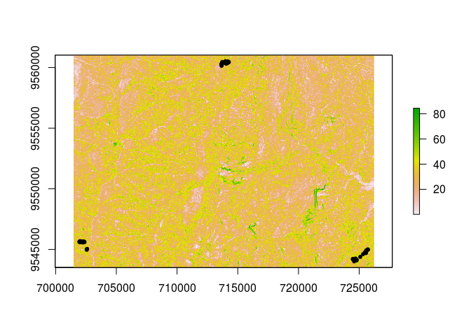

Calculation of the Topographical Position Index, slope and aspect for the MATRIX plots (Loja/Zamora province, Southern Ecuador)
================

Project structure
-----------------

``` text
**top level scripts**
/               01_extract_tpi_aspect_slope.r: Calculates and exports the raster with 
                TPI values, aspect and slope data and extracts values for the MATRIX plots
/data/raw       folder with .xls(x)-files with raw data
/data/processed folder with .csv-files with re-named column titles    
/output/rasters/      -- folder for ASCII rasters with the generated TPI, slope 
                         and aspect values (too large for GitHub)
      /Matrix_Plots_positions_complete_TPI_aspect_slope.csv        
                      -- extracted values for the MATRIX plots 
/rasters        folder for raster files used in the script (too large for GitHub)
/scripts        circular_tpi.r: calculates TPI based on a circular reference 
                area                               
```

Description
-----------

The scripts in this project use R's raster package to calculate the Topographical Position Index (Weiss, 2001) for all grid cells in the digital elevation model from Jordan et al., 2005 (based on the newest revised version from Ungerechts, 2013).

The TPI values are calculated on the scale and extent of the DEM from Ungerechts, 2010 (spatial resolution: 10 m) based on a script published in my Master's thesis (Link, 2014), and then extracted from the resulting ASCII averaging over a circular neighbourhood with a diameter of sqrt(20^2 + 20^2) m (the plot diagonal of the MATRIX plots). The reference diameter of the TPI values is set to 200 m.

Slope and aspect are calculated using the terrain() function from the raster package. Note that while there terrain() can also be used to calculate TPI, contains an option to calculate CPI, this method does only include the 8 adjacent cells and does not allow for circular neighbourhoods.

As a) both the input and the output rasters are prohibitively large and b) I am not sure about the legal implications of sharing the the raster data of Ungerechts, 2010, the project on GitHub only includes the code and extracted values for the MATRIX plots.

If there are questions, do not hesitate to get in touch!

Generated rasters
-----------------

Here are some (ugly) plots of the generated rasters to give an idea what this project is doing.

### TPI (based on 200 m circular neighbourhood)

``` r
# load raster library
library("raster")
```

    ## Loading required package: sp

``` r
# load MATRIX plot positions
pos <- read.csv("data/csv/Matrix_Plots_positions_neu.csv") 

# set coordinates and projection
coordinates(pos) <- ~utmx + utmy

crs <- "+proj=utm +zone=17 +south +ellps=WGS84 +datum=WGS84 +units=m +no_defs +towgs84=0,0,0"
projection(pos)<- CRS(crs)

# get extent of the Matrix plots
ext <- extent(pos) + 1000


# load raster with slope data
tpi <- raster("output/rasters/tpi_radius_200m_res_10m_UTM17_WGS24.asc")

# plot TPI for the matrix plots
plot(crop(tpi, ext))
points(pos, pch = 20)
```


### Slope (degrees)

``` r
# load raster with slope data
slope <- raster("output/rasters/slope_degrees_res_10m_UTM17_WGS24.asc")

# plot slope for the matrix plots
plot(crop(slope, ext))
points(pos, pch = 20)
```



### Aspect (degrees)

``` r
# load raster with aspect data
aspect <- raster("output/rasters/aspect_degrees_res_10m_UTM17_WGS24.asc")

# plot aspect for the matrix plots
plot(crop(aspect, ext))
points(pos, pch = 20)
```


References
----------

-   Jordan, E., Ungerechts, L., Caceres, B., Penafiel, A., Francou, B., **2005**. *Estimation by photogrammetry of the glacier recession on the Cotopaxi Volcano (Ecuador) between 1956 and 1997.* Hydrol. Sci. J.-J. Sci. Hydrol.50 (6), 949–961.

-   Link, R.M., **2014**. *Spatial distribution of angiosperm species in a tropical Andean mountain ecosystem in southern Ecuador.* Master's Thesis. University of Göttingen, Germany.

-   Ungerechts, L., **2010**. *DEM 10m (triangulated from aerial photo - b/w).* Available online (<http://www.tropicalmountainforest.org/data_pre.do?citid=901>) from DFG-FOR816dw. \[Date of download: 2013-05-27\].

Weiss, A., **2001**. *Topographic position and landforms analysis.* Poster presentation, ESRI User Conference, July 2001, San Diego, CA.
